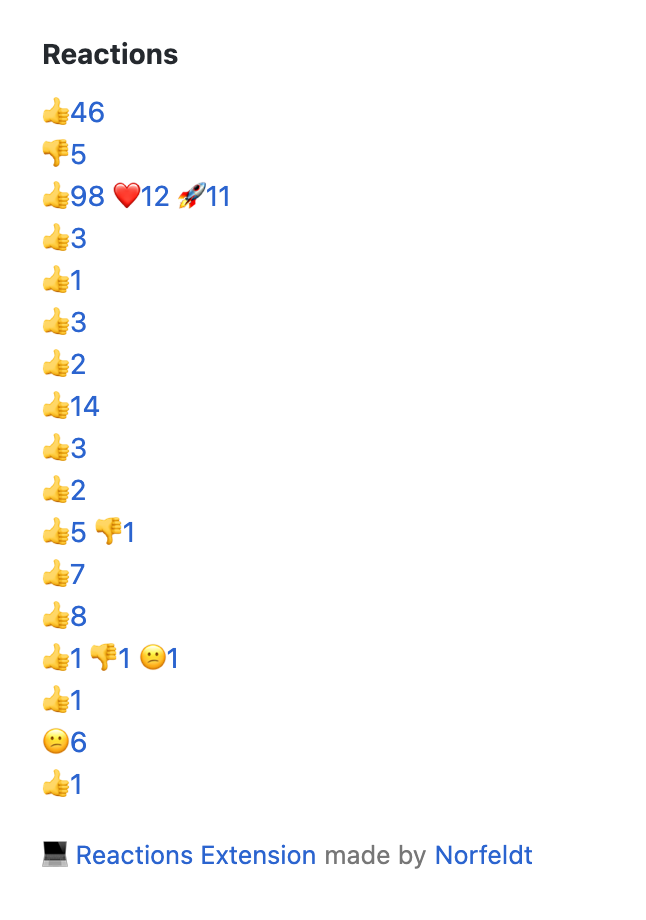

# Github Issue Reactions Chrome & Firefox Extension

List a link of reactions on a Github issue page

## Chrome Setup

1. Clone this repo
2. Open Chrome Extensions
3. Enable Developer mode
4. Pick Load unpacked and pick the cloned repo
5. Enjoy! 👍

## Firefox Setup

1. Clone this repo
2. Go to "about:debugging"
3. Click "This Firefox"
4. Click "Load Temporary Add-On"
5. Select the `github_issue_reactions.js` file from this repo
6. Enjoy! 👍

## Not Working Any More?

Try to do a git pull to see if it has been fixed (**DO NOT FORGET go into your extensions and reload the lasted version**).

---

## Why is it not on the Chrome Web Store?

In the future it might come, but for now it's just easier to distribute it this way.

Another good reason would be that it is more secure to inspect and control an extensions that injects code into your Github (both private and public pages).
