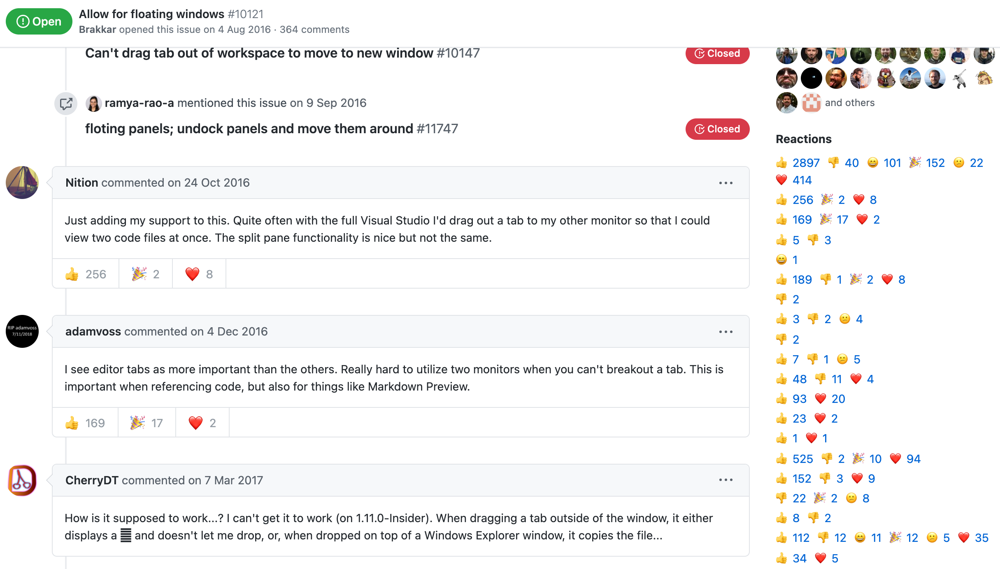

# github-issue-reactions-chrome-extension
List a link of reactions on a github issue page

## Setup

1. Clone this repo
3. Open Chrome Extensions
4. Enable Developer mode
5. Pick Load unpacked and pick the cloned repo
6. Enjoy!
